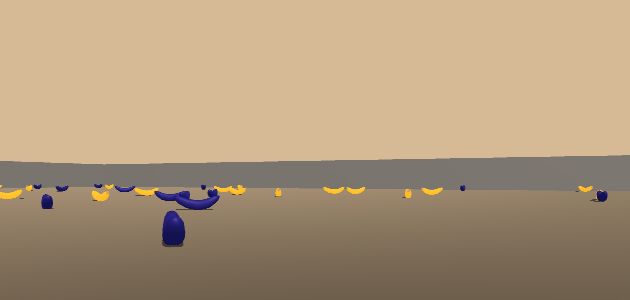
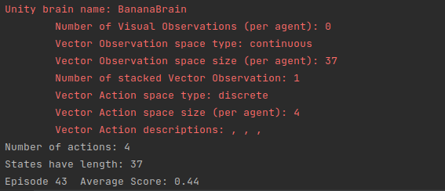

# Navigation-Deep-RL



## Project Details 

This repository contains python code that implements _deep reinforcement learning_ to solve a game of collecting yellow bananas, with the success criteria being the agent maintaining an average score above 13 for 100 episodes.

### Environment Details

The game environment is a box with several yellow and blue bananas, with the game state being represented as a space of 37 dimensions to the agent (the part that learns to play the game).  The agent has 4 actions available to it:

1. Move forward
2. Move backward
3. Orient Leftward
4. Orient Rightward

Lastly, the yellow bananas are worth a reward of +1 for the agent, while the blue bananas are worth a reward of -1. 

## Getting Started

Follow the steps below to setup an environment to run the project.

Start by creating a new environment with python 3.6 (**Note:** python 3.6 is necessary for tensorflow 1.7.1 and the unity environment will not work without this version.)

```bash
conda create --name drlnd python=3.6
source activate drlnd
```

Next, clone the __deep-reinforcement-learning__ repository to install the _unity agent_ dependency.

```bash
git clone https://github.com/udacity/deep-reinforcement-learning.git
cd deep-reinforcement-learning/python
pip install .
```

Then, use _pip_ to install the requirements detailed in the requirements text file.

```bash
pip install -r requirments.txt
```

Finally, add the _conda_ environment to _jupyter_ if there is a desire to use Navigation notebook

```bash
python -m ipykernel install --user --name drlnd --display-name "drlnd"
```

## Instructions

The agent can be trained by running the cells in the jupyter notebook or by executing _main.py_ with

```python
python main.py
```

Running main.py will start up the unity environment and begin training the model.


