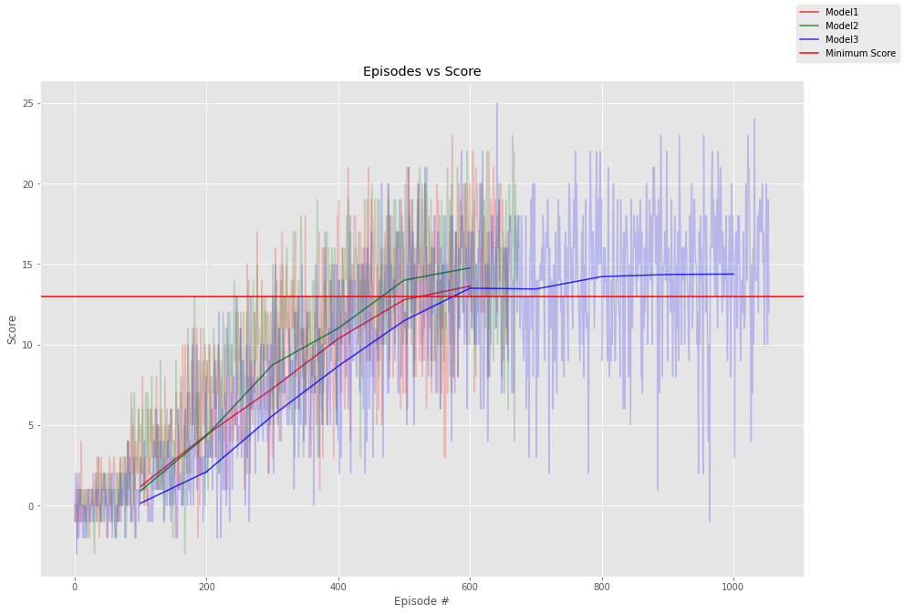

## Introduction

This project used deep reinforcement learning to train an agent to collect yellow bananas and avoid blue bananas in a game. The game had a state space of 37 dimensions, with the agent having four actions and being rewarded positively for collecting yellow bananas while being rewarded negatively for collecting blue bananas. The agent was considered successful if it could average a score greater that 13 in 100 trials. In this report, the learning algorithm, the performance of the algorithm, and ideas for future work are all discussed.

## Learning Algorithm

The learning algorithm used in this project is based on the algorithm presented by Mnih et al. (2015). It uses a _neural network_ to estimate the optimal action value function and utilizes _experience replay_ and _iterative update_ to make the algorithm stable, as shown by Mnih et al. (2015). The following two subsections detail the architecture of the neural networks utilized and the learning algorithm that used the neural networks

#### Neural Network Architectures

Mnih et al. (2015) utilized a network architecture with two convolutional layers and two fully connected layers. The networks used in this project deviate by not having convolutional layers.

The neural network architecture used in this project consisted of three fully connected layers, with the first two having the same number of nodes (alternated between 32,64,128) and the third layer using only four nodes due to the action space consisting of four actions.

Additionally, the rectified linear unit function was the only activation function used in the network.

#### Learning Algorithm Procedure

The following is the pseudo code for the learning algorithm used in this project.

```
ALLOCATE REPLAY_BUFFER (SIZE = 100000, BATCH = 64)

Initialize local_network
Initialize target_network #Note: Uses the same weights as the first network

FOR EACH Episode:
	RESET environment
	DO UNTIL done:
		Get state
		Get action_values_array using local_network and the state
		Get action from action_values_array randomly or take the max
		UPDATE environmet with selected action
		Get state (as next_state), reward, done from environment
		
		UPDATE REPLAY_BUFFER(state, action, reward, next_state, done)
		
		If the buffer has more than 64 elements & is a learning iteration:
			RANDOM SAMPLE REPLAY_BUFFER(64)
			Get max target from target_network(next_states)
			Get targets from (rewards + (.99 * target * (1 x dones)))
			Get expected from local_network(states)
			Get error from MSE(targets, expected)
			Optimize with Adam
			
			UPDATE local_network weights with target_network
	DECREASE epsilon	
```

Additionally, some of the parameters of interest used in this algorithm are itemized below:

1. Learning Rate: .0005
2. Gamma: 0.99
3. Tau (for neural network weight updates) 0.001
4. Update Rate: 4

## Performance



The image above plots the scores of the the algorithm using the different neural network node sizes. The the shaded background consists of the individual scores for the agent using the different networks and the thicker solid line is the average. The plot seems to suggest that smaller node sizes perform better that larger node sizes and 64 nodes seems to be the best of the three sizes used. The training with 32 and 64 node sizes took around 500 episodes while the training with the 128 node network took a little over 1000 episodes.

## Future Work

While modifying the neural network architecture to use lower node sizes seemed to improve the performance, there are other improvements to the algorithm itself that could be made.  One such improvement that could be implemented would be prioritized experience replay, as described by Schaul et al. (2016). The current implementation of experience recall in the project uses uniform sampling of experiences; however, the prioritized approach detailed by Schaul et al. (2016) would use the temporal difference error to give priority to the experience. The larger the error, the higher the priority would be. Prioritized sampling introduces problems of bias and a loss of sampling diversity which would need to be corrected for, as described by Schaul et al. (2016).

## References

Volodymyr Mnih, Koray Kavukcuoglu, David Silver, Andrei A. Rusu, Joel Veness, Marc G. Bellemare, Alex Graves, Martin Riedmiller, Andreas K. Fidjeland, Georg Ostrovski, Stig Petersen, Charles Beattie, Amir Sadik , Ioannis Antonoglou, Helen King, Dharshan Kumaran, Daan Wierstra, Shane Legg & Demis Hassabis. (2015). *Human-level control Through Deep Reinforcement Learning*. Nature 518. https://www.nature.com/articles/nature14236

Tom Schaul, John Quan, Ioannis Antonoglou & David Silver. (2016). *Prioritized Experience Replay*. https://arxiv.org/abs/1511.05952
